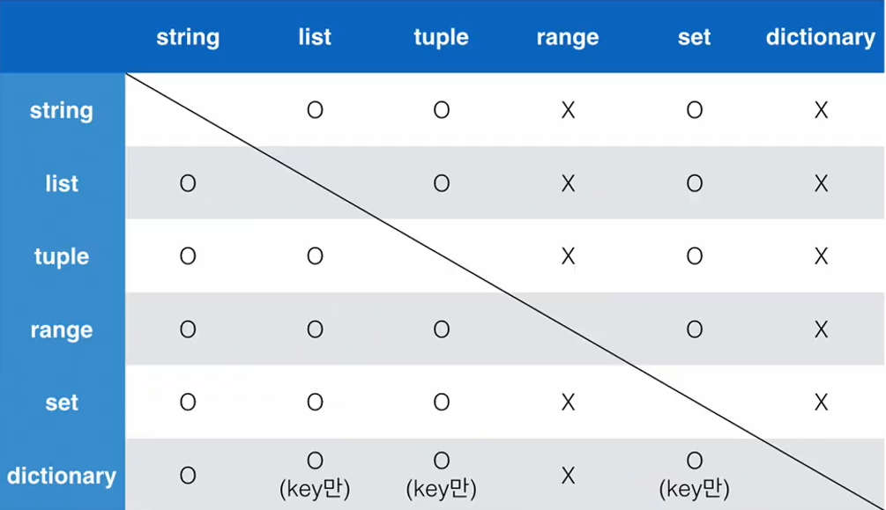

# 파이썬의 기초 온라인강의

## 목차
- [마음가짐](#마음가짐)

- [프로그래밍이란?](#프로그래밍이란?)

- [파이썬과 개발환경](#파이썬과-개발환경)

- [기초문법](#기초문법)
  - [변수](#변수)
  - [연산자](#연산자)
    - [산술 연산자](#산술-연산자)
    - [비교 연산자](#비교-연산자)
    - [논리 연산자](#논리-연산자)    

- [자료형](#자료형)
  - [수치형](#수치형numeric-type)
      - 정수
      - 실수
      - 복소수
  - [문자열](#문자열string-type)
  - [논리형](#논리형boolean-type)
  - [None](#none)

- [컨테이너](#컨테이너)
  - 순서가 있는 컨테이너
    - [list](#list)
    - [tuple](#tuple)
    - [range](#range)
  - 순서가 없는 컨테이너
    - [set](#set)
    - [dictionary](#dictionary)

- [형 변환](#형-변환typecasting)

- [제어문](#제어문)
  - [조건문](#조건문)
  - [반복문](#반복문)
    - [while](#while)
    - [for](#for)
    - [반복문 제어](#반복문-제어)

- [함수](#함수)
  - [함수의 기본구조](#함수의-기본구조)
  - [유용한 함수들](#유용한-함수들)
    - [Built-in 함수](#bulit-in-function)
    - [lambda 함수](#lambda-함수)
    - [재귀 함수](#재귀-함수)

- [모듈](#모듈) 
  - [모듈과 패키지](#모듈과-패키지)
  - [파이썬 패키지 관리자](#파이썬-패키지-관리자pip)

- [가상환경](#가상환경)
  - [가상환경 생성](#가상환경-생성)
  - [가상환경의 활성화/비활성화](#가상환경의-활성화비활성화)

   
---
---

## 마음가짐
- 프로그래밍 학습 효율을 높여줄 마인드셋
  1. **개념 구조화하기**
      - 프로그래밍에서 개념을 명확히 알고, 그것을 구조화하는 것이 중요!
      - 구조화란, 어떠한 개념이 있으면, 해당 개념과 하위 개념들을 잘 묶어서 머리에 저장하는 것
      - 구조화를 할 때는 우선 개념의 정의가 중요! 머릿속에 구체적으로 나만의 정의를 확립.
      - 다른 정의들과 엮어가며 정리하며 머릿속에 개념구조를 만들자!

  2. **기본기 탄탄하게 쌓기**
      - 코드를 작성하지 않고 프로그래밍을 배울 수는 없다!
      - 배운 코드는 써봄으로써 머릿속으로 들어온다!
  3. **동료학습**
      - 친구에게 개념들을 설명해보면 내가 이해했는지 확실히 알 수 있다.(learn by teaching)
      - 친구가 이해하지 못하는 부분을 도와주다 보면 내 이해를 명확하게 할 수 있다.
      - 모르는 것은 바로 물어보자! 지식의 빈틈을 확실히 매우자
      - 실제 회사에서도 팀플레이가 중요! 커뮤니케이션 스킬을 키우자

---
---

## 프로그래밍이란?
### 프로그래밍의 정의
- 프로그래밍이란 프로그램을 만드는 행위
- 프로그램이란, 특정 작업을 수행하는 일련의 명령어들의 모음(사전적 정의)
- 원하는 작업을 수행하기 위해서 논리구조를 짜는것. 그것을 코드를 통해 표현

```
프로그래밍 : 컴퓨터에게 일을 시키기 위해서 프로그램을 만드는 행위
프로그램 : 컴푸터가 해야할 일들의 모음
프로그래머 :  프로그램을 만드느 사람(소프트웨어 개발자)
소프트웨어 : 프로그램과 엄밀히는 다르지만, 프로그램과 유사한 의미로 활용
코딩 : 프로그래밍과 엄밀히는 다르지만, 프로그래밍과 유사한 의미로 사용
```

### 프로그래밍 언어란 
- 언어란 자신의 **생각을 나타내고 전달**하기 위해서 사용하는 체계
- 문법적으로 맞고 같은 언어를 쓰는 사람 사이에서 **이해될 수 있는** 말의 집합
- 컴퓨터의 언어는 **0과 1로 이루어진 기계어**이다. 이는 사람이 이해하기 어려움
- 기계어의 대안으로 **사람이 이해할 수 있는** 새로운 언어를 개발 -> 프로그래밍 언어
### 프로그래밍 언어의 구성
- 소스코드
- 소스코드는 프로그래밍 언어로 작성된 프로그램
- 번역기(interpreter 혹은 compiler)
- 소스코드를 컴퓨터의 언어인 기계어로 번역해서 동작하도록 해주는 것

---
---

## 파이썬과 개발환경

### 파이썬을 배워야 하는 이유

1. 알고리즘 코딩테스트에 유리
    - 알고리즘 코딩테스트에서 PYTHON이 ***2위***를 기록!
    - 코딩테스트의 유형이 다양해지면서, **변칙적인 유형에 대응**하기 쉬운 파이썬이 코딩테스트에 유리, 그 결과 최근 3년간 파이썬이 급증
    - 대회준비를 원한다면, C를 추천(빠른 동작속도) 하지만 **입사를 준비한다면 PYTHON**이 유리!

2. 구현 코딩 테스트에 유리
    - 유용한 라이브러리를 최소한으로 사용해서 프로그램을 개발할 수 있음
    - 실행시간이 매우 중유한 유형이 아닌 경우, 파이썬으로 코딩테스트를 준비하는 것이 최선의 선택(한국기준)

3. 가장 인기많은 언어
    - 프로그래밍의 인기 척도로 사용하는 `PYPL index` 와 `TIOBE index` 에서 2022년 6월 기준 1위!
    - AI, 데이터분석, 웹 프로그래밍, 업무자동화 등 파이썬 활용분야가 늘어나서, **많은 회사**에서 사용

---

### 파이썬의 특징

- Easy to learn
  - 파이썬은 다른 프로그래밍 언어보다 문법이 간결하고, 유연함(변수 타입저장이 필요없음)
  - 비교적 쉽게 배우고, **프로그래밍 사고**에 집중할 수 있음

- 인터프리터 언어(INTERPRETER)
  - 파이썬은 소스코드를 기계어로 변환할 때 통역하듯이 1줄씩 변환

- 객채 지향 프로그래밍(Opject Oriented Programming)
  - 현대 프로그래밍의 기본적인 설계방법론으로 자리잡은 객체 지향 프로그래밍
  - 파이썬은 객체 지향 언어이며, 모든것이 객체로 구현되어 있음 (나중에 정리)

---

### 개발환경

#### IDE란?(Integrated development envirment)
- 통합 개발 환경의 약자로 개발에 필요한 다양하고 강력한 기능들을 모아둔 프로그램
- 보통 개발은 IDE에서 진행함
- 개발에 필요한 다양한 편의기능들을 제공

---

### 코드 작성법

#### 코드 스타일 가이드
- 코드를 __어떻게 작성할지__ 에 대한 가이드라인
  - 파이썬에서는 [PEP8](https://peps.python.org/pep-0008/) 이라는 스타일 가이드를 제안함.
  - 회사마다 프로젝트마다 서로 다른 가이드 존재 가능.
- 코드 스타일은 맞춤법과 같다!(이해할 수 있지만 가독성이 매우 떨어진다)

#### 주석

1. 한줄 주석
  - 주석으로 처리될 내용 앞에 `#`을 입력
    - 한줄을 모두 사용할 수 도 있고, 소스코드 뒤에 붙여서 사용할 수도 있다.
```python
# 한줄을 모두 사용할 수 있음
print('hello comment') # 코드 뒤에 붙여서 사용할 수도 있음
```
2. 여러 줄 주석
  - 여러줄 주석
    - 한 줄씩 # 을 사용하거나
    - `"""` 또는 `'''` 로 묶어서 사용
```python
# 이렇게
# 한줄씩
# 쓸 수 있다
"""
이렇게 여러줄을 한번에
주석처리 할 수 있다.
"""
```
- 코드에 대한 설명
  - 코드를 보다 이해하기 쉽게 하여 __분석 및 수정__ 에 용이하다
  - 주석은 코드를 보다 __이해하기 쉽게__ 하여 분석 및 수정에 용이하다.
- 개발자 초기부터 들여야 할 __가장 중요한 습관__ 
  - 개발자에게 주석을 다는 습관은 매우 중요
  - 잘 달린 주석은 그 어떤 정보보다 유용하다!
    - 주석은 실행에 __영향을 미치지 않을__ 뿐 아니라
    - 프로그램의 __속도를 느리게 하지 않고, 용량을 늘리지 않음__

---
---

## 기초문법

### 변수

- 컴퓨터는 어떻게 저장하고, 이름을 붙이는가?
- 데이터를 어떻게 저장하고, 처리하는 것인가가 프로그래밍의 핵심!
- 데이터를 담는 자료구조가 `변수` 이다!

__변수는 데이터를 저장하기 위해서 사용한다__
- 변수를 사용하면 복잡한 값들을 쉽게 사용할 수 있다.(추상화)
- 동일한 변수(이름)에 다른 데이터(값)을 언제든지 할당(저장)할 수 있기 때문에, `변수`라고 불림 

#### 추상화

- 추상화를 하지 않고 직접 값을 대입하여 프로그래밍 해도 실행하면 결과가 나온다. 하지만 여러 문제가 있음
  - 일일이 데이터값을 넣는 것이 불편하다
  - 데이터 값이 무엇을 의미하는지 알 수 없음
  - 추후에 데이터가 변화했을 때, 일일이 찾아서 고쳐야 한다

- 추상화를 이용해서 변수(이름)을 사용해서 의미를 표현하면
  - 데이터값 대신 변수를 사용한다
  - 변수가 무엇을 의미하는지 확인이 가능하다.
  - 추후에 데이터값이 변하면, 변수에 대입한 값만 바꿔서 모든 코드의 데이터를 관리 할 수 있다.
---

#### 변수의 할당
- 변수는 할당 연산자`=`를 통해 값을 할당(assignment)
` a = 1 `
- 같은 값을 동시에 다른 변수에 할당 할 수 있음
` a = b = 2 `
- 다른 값을 동시에 할당 할 수 있다.
` a, b = 1, 2 `
- 각 변수의 값을 바꿔서 저장할 수 있다.
```python
a, b = 1, 2
a, b = b, a
print(a, b) # 2 1
```

#### 식별자(변수의 이름)
- 식별자의 이름은 `영문 알파벳`, `_(언더스코어)`, `숫자로 구성`
- 첫 글자에 숫자가 올 수 없고,
- 길이 제한이 없고, 대소문자를 구별
- 특정 키워드(keyword)는 예약어(reserved words)로 사용되어 식별자로 사용할 수 없음
- 또한 내장 함수나 모듈 등의 이름도 사용하지 않아야 함.
  - 내장 함수의 동작을 예상할 수 없게 임의로 값을 할당하게 되어서 범용적이지 않은 코드가 된다.


---

### 연산자

#### 산술 연산자
- 산술 연산자는 사칙 연산 및 수식 계산에 사용됨
```
+  :  덧셈
-  :  뺄셈
*  :  곱셈
/  :  나눗셈
** :  거듭제곱
// :  몫
%  :  나머지
```
- 산술 연산자는 수학에서 사용하는 연산 우선순위가 적용됨
  - 괄호가 가장 먼저 계산되고, 그 다음에 곱셈 나눗셈, 더하기 빼기 가 연산됨
  - 더 자세한 내용은 공식문서 연산처리를 참고
---

#### 비교 연산자
- 수학에서 등호, 부등호와 동일한 개념이다.
- 주로 조건문에서 사용되며, 값을 비교할때 사용한다.
- 결과는 `True`, `False` 값을 리턴한다.
```
> , <   : 미만, 초과
== , =! : 등호, 부등호
>=, <=  : 이하, 이상
is, is not : OPP 인가, 아닌가

```
---

#### 논리 연산자
- 여러가지 조건이 있을때 사용. 이때 조건은 Boolean형을 의미한다.
  - 모든 조건을 만족하거나(`and`), 여러 조건 중 하나만 만족해도 될 때(`or`) 특정한 코드를 실행하고 싶을때 사용
  - 일반적으로 비교 연산자와 함께 사용됨
  - 논리연산자도 우선순위가 존재한다
    - not, and, or 순으로 우선순위가 높다.
  ```
  A and B   :    A와 B가 모두 True 일때 True
  A or B    :    A와 B중 하나라도 True이면 True
  not A     :    A가 True면 False, False 면 True
  ```
  - 논리 연산자는 결과값이 확실한 경우 뒤의 값을 확인하지 않고, 결과를 반환한다. 이를 단축평가라고 한다.
  - 이러한 이유로 __Boolean형이 아닌 경우__, 출력값이 앞의 값이 될지 뒤의 값이 될지 확인하여야 한다. 
  ```python
  False and anything # False와 and는 항상 False 이므로 뒤 값을 확인하지 않고 False
  True or anything # True와 or은 항상 True 이므로 뒤 값을 확인하지 않고 True
  5 and 4 # 5(True) and 4(True) 이므로 뒤의 값 4가 반환
  0 and 4 # 0(False) and 이므로 단축평가되어 앞의 값 0가 반환
  0 or 4 # 0(False) or 4(True) 이므로 뒤의 값 4가 반환
  5 or 0 # 5(True) or 이므로 단축평가되어 앞의 값 5가 반환
  ```

---
---

## 자료형

- 프로그래밍에서는 __다양한 종류__ 의 데이터(값)를 쓸 수 있음
- 사용할 수 있는 __데이터의 종류__ 를 자료형이라고 한다

### 자료형의 분류
#### 수치형(Numeric Type)
1. integer : 정수
    - 우리가 사용하는 양의정수, 음의정수, 0을 표현
    - 일반적인 연산처리를 사용할 수 있음
    - 여러 진법으로 표현 가능
    - 2진수  : 0b... (__b__ inary)
    - 4진수  : 0o... (__o__ ctal)
    - 16진수 : 0x... (he __x__ adecimal)
2. float   : 실수
    - 유리수와 무리수를 포함하는 `실수`를 다루는 자료형
    - 실수의 값을 처리할 때는 `부동 소수점`을 사용하기 때문에 의도하지 않은 값이 나올 수가 있음
    ```
    부동소수점

    컴퓨터는 2진수(0과 1)를 사용하고, 인간은 10진수를 주로 사용함
    이때 10잔수 0.1을 2진수로 표현하면, 0.0001100110011001100110... 과 같이 무한대로 반복되는 무한소수가 된다.
    무한대의 숫자를 저장할 수는 없으므로, 근사값을 이용해서 저장한다
    0.1 의 경우 3602979701896397/(2^55)으로 표현하며, 0.1에 가깝지만, 같지 않다!
    이런 과정에서 예상하지 못한 결과가 나타나기도 한다.(이를 Floating point rounding error라고 함)
    만약, 실수의 비교를 실행하는 코드가 필요하다면, math모듈을 활용하여 근사한지 확인해야 한다.
    ``` 
3. complex : 복소수
---

#### 문자열(String Type)
- 모든 문자는 str타입
- 문자열은 `' '`나 `" "` 로 표기
  - 문자열을 묶을 때는 __동일한 문장부호__ 로 묶어야 한다.
  - PEP8에서는 소스코드 내에서 하나의 문장부호로 __통일__ 하기를 권장한다.
  - 따옴표 안에 따옴표를 표현할 경우
  ```python
  "문자열 안에 '작은 따옴표'를 사용하려면, 큰 따옴표로 묶는다."
  '문자열 안에 "큰 따옴표" 를 사용하려면, 작은 따옴표로 묶는다.'
  ```
  -삼중 따욤표
  ```python
  ''' 문자열 안에 '작은 따옴표'나 
  "큰 따옴표"를 활용하거나, 여러
  줄에 따옴표를 활용할 때 유용하다'''
  ```
- Escape sequence
  - `\`(backslash)뒤에 특정 문자가 와서 특수한 기능을 하는 문자 조합
  - 문자열 내부에서 공백, 줄바꿈 등 __다양한 표현__ 을 위해서 사용한다.
- 문자열 연산
  - 덧셈
    - 숫자형 연산은 7+6은 13
    - 문자의 덧셈은? 파이썬에서는 문자열을 더하면 순서대로 이어준다!
  - 곱셈
    - 문자의 곱셈은? 파이썬에서는 문자열을 곱하면 여러번 반복해서 이어준다!
- String Interpolation
  - 문자열 안에서 변수를 활용해서 표현하기 위한 방법
    - %-fromatting : % 뒤에 자료형을 의미하는 문자를 적고, 문자열 뒤에 변수를 붙여 표현 (과거에 사용)
    - str.format() : 원하는 위치에 빈 중괄호를 두고, 문자열 뒤에 메소드로 변수를 지정 (과거에 사용)
    - f-string : 원하는 위치에 중괄호를 써서 변수를 삽입
```python
name = 'kim'
score = 4.5

print(f'Hello, {name}!, 성적은 {score}')
# Hello, kim!, 성적은 4.5
```
---

#### 논리형(Boolean Type)
- Boolean 형이라고 부르며, 참 거짓을 표현하는 자료형
- `True` 또는 `False` 를 값으로 가지며 비교/논리 연산에 사용한다.
- `Falsy` : `False`는 아지니만, `False`로 취급 되는 다양한 값
  - `0`, `0.0`, `()`, `[]`, `{}`, `None`, `""`(0, 빈 자료형, 빈 문자열, None)
---

#### None
- python 자료형 중 하나
- 값이 없음을 표현하기 위해서 None 타입이 존재
- 일반적으로 __반환값이 없는 함수__ 에서 사용하기도 함

---
---

## 컨테이너

- 여러 개의 값(데이터)을 담을 수 있는 것(객체)으로, 서로 다른 자료형을 저장할 수 있음
- 컨테이너는 순서가 있는 데이터와, 순서가 없는 데이터로 분류되어 있다.
- 위에서 사용한 `string`(문자열)도 컨테이너의 하나로 볼 수 있다.
  - 순서가 있는 데이터는 순서를 이용해서 데이터를 호출할 수 __있다.__
    - `list`, `tuple`, `range`, `string`
  - 순서가 없는 데이터는 순서를 이용해서 데이터를 호출할 수 __없다.__  
    - `set`, `dictionary`  
 ---

### 순서가 있는 컨테이너

#### `list`

- `list`는 여러개의 value를 __순서가 있는 구조__ 로 저장하고 싶을때 사용
- `list`는 `[]`(대괄호) 혹은 `list()`를 통해 생성
  - 파이썬에서는은 어떠한 자료형도 저장할 수 있으며, 리스트 안에 리스트를 넣을 수 도 있다.
  - 생성된 이후에도 내용이 __변경가능__ 하다
  - 이러한 유연성때문에 파이썬에서 가장 흔히 사용한다.
- __순서가 있는__ ___index___ 를 통해서 접근 가능
  - 값에 대한 접근은 `list[i]`로 사용
  - `i`(index)는 항상 0부터 시작한다. -1 은 뒤에서 첫번째라는 의미이다.
```python
my_list = []
another_list = []
print(type(my_list)) # <class 'list'>
print(type(another_list)) # <class 'list'>

location = ['서울', '대전', '대구', '광주', '부산', '울산']
print(location) # ['서울', '대전', '대구', '광주', '부산', '울산']
print(location[0]) # 서울
```
---

#### `tuple`

- `tuple`은 여러개의 value를 __순서가 있는 구조__ 로 저장하고 싶을때 사용
- `tuple`은 `()`(소괄호) 혹은 `tuple()`을 통해 생성
  - `tuple`은 생성된 이후에 내용이 __변경 불가능__ 하다
  - 한 원소로 `tuple`을 생성할 때는 값 뒤에 쉽표를 붙여아 한다.
  - 여러 원소로 `tuple`을 생성할 때는 값 뒤에 쉽표를 붙여아 할 필요는 없지만, 권장된다.
```python
tuple_a = (1,) # 한 원소로 tuple을 생성할 때는 값 뒤에 쉽표를 붙여아 한다.
tuple_b = (1,2,3) # 여러 원소로 `tuple`을 생성할 때는 값 뒤에 쉽표가 없어도 된다.
tuple_b = (1,2,3,) # 여러 원소로 `tuple`을 생성할 때는 값 뒤에 쉽표가 권장된다.
```
- 튜플 대입이란?
  - 우변의 값을 좌변의 변수에 한 번에 할당하는 과정
  - `x, y = 1, 2` 와 같은 값의 처리는 실제로는 튜플 대입으로 처리된다
---

#### `range`

- 숫자의 시퀀스(연속적인 값)을 나타내기 위해 사용한다.
- 주로 반복문과 함께 사용된다
- 기본적으로는 0부터, n-1 까지 1씩 증가하는 시퀀스를 내놓는다.
- Range의 사용법
  1. 기본형 
    - 0 부터 n바로 앞 까지의 정수의 시퀀스 `range(4) == [0, 1, 2, 3]`
  2. 범위 지정
    - n 부터 m바로 앞 까지의 정수의 시퀀스 `range(4, 8) == [4, 5, 6, 7]`
  3. 범위 및 스텝 지정
    - n 부터 m바로 앞 까지의 정해진 폭으로 변하는 정수의 시퀀스 `range(4, 9, 2) == [4, 6, 8]`
    - 음수의 스텝도 가능 `range(4, 0, -1) == [4, 3, 2, 1]`
---

#### 슬라이싱 연산자
- `index`와 `:`을 사용해서 시퀀스의 특정 부분만 잘라낼 수 있음
- 슬라이싱을 이용하여 시퀀스를 나타낼 때, 콜론을 기준으로 ___앞 인덱스에 해당하는 원소는 포함되지만, 뒤 인덱스의 원소는 미포함___
- 범위와 스텝을 자유롭게 설정해서 다양하게 슬라이싱 가능하다!
- 이때 값을 비워두면 범위는 양 끝점, 스텝은 1을 의미한다.
```python
test = [1, 2, 3, 4, 5]
test[0:3] # [1, 2, 3]
text[2:5] # [3, 4, 5]
test[0:5:2] # [1, 3, 5]
test[-1:-4:-1] # [5, 4, 3]
test[:3] # [1, 2, 3]
test[3:] # [3, 4, 5]
test[::] # [1, 2, 3, 4, 5]
test[::-1] # [5, 4, 3, 2, 1]
```
---
### 순서가 없는 컨테이너

#### `set`

- `set`이란 __중복되는 요소__ 가 없는, __순서에 상관없는__ 데이터들의 묶음
  - 중복을 허용하지 않기 때문에 같은 원소가 있다면 하나만 저장한다.
  - 순서가 없기 때문에 index를 이용한 접근이 불가능하다.
- 수학에서의 집합을 표현한 자료형이다
  - 수학의 집합처럼 합집합, 교집합, 차집합 등의 연산이 가능하다.
- 담고있는 요소를 삽입, 변경, 삭제가 가능하다. mutable(가변가능)
- `set`은 `{}` 혹은 `set()`을 통해 생성
  - 빈 `set`을 만들기 위해서는 반드시 `set()`을 활용해야 한다.
- 순서가 없어 별도의 값을 호출할 수 없음
```python
{1, 2, 3, 1, 2} # {1, 2, 3} 중복값을 허용하지 않는다.
my_set = set() # 빈 set을 생성하려면, 반드시 set()함수를 활용해야 한다.
```
-`set` 연산자가 존재, 이는 집합연산에 활용한다.
```
set A, B 에 대해서 연산을 진행하면
A = {1, 2, 3, 4}
B = {1, 2, 3, 'hello', (1, 2, 3)}
A | B (pipeline) : 합집합 # {1, 2, 3, 4, "hello", (1, 2, 3)}
A & B (and)      : 교집합 # {1, 2, 3}
B - A            : 차집합 # {'hello', (1, 2, 3)}
A ^ B (hat)      : 대칭차집합 # {4, 'hello', (1, 2, 3)}
```
---

#### `dictionary`

- `dictionary`는 `key`와 `value`가 쌍으로 이루어진 자료형이다.
- 3.7 미만 버전은 unordered, 3.7 부터는 ordered 자료형이다.
- `key`는 변경 불가능한 데이터만 사용 가능 __(immutable)__
  - `string`, `integer`, `float`, `boolean`, `tuple`, `range`
- `value`는 어떠한 데이터든 사용 가능
- `dictionary`는 `{}`(중괄호) 혹은 `dict()`함수를 이용해서 생성
-  `key`를 통해 `value`에 접근
```python
my_dict = {}
my_dict = {'a': 'apple', 'b': 'banana', 'list' : [1, 2, 3]}
my_dict2 = dict(a='apple', b='banana', 'list'=[1, 2, 3]) #위 dictionary와 같음
print(my_dict) # {'a': 'apple', 'b': 'banana', 'list' : [1, 2, 3]}
print(my_dict2) # {'a': 'apple', 'b': 'banana', 'list' : [1, 2, 3]}
print(my_dict['list']) # [1, 2, 3]
```

---
---

## 형 변환(Typecasting)
- 파이썬에서 데이터 형태는 서로 변환할 수 있음
- 암시적 형 변환(Implict)
  - 사용자가 직접 하지않고, 파이썬 내부적으로 자료형을 변환하는 경우
  ```python
  print(True + 3) # 4  <- True를 1로 자동으로 변환한 뒤 계산
  print(3 + 5.0) # 8.0 <- 3을 3.0으로 자동으로 변환한 뒤 계산
  ```
- 명시적인 형 변환
  - 사용자가 특정 함수를 활용하여 의도적으로 자료형을 변환하는 경우
  - `int()`
    - `str`, `float` => `int` 로 변환하는 함수
    - 단, 형식에 맞는 문자열만 `int`로 변환 가능
    ```python
    print('3' + 4) # TypeError 발생 

    print(int('3') + 4) # 7

    print(int('3.5') + 5) # ValueError 발생
    ```
  - `float()`
    - `str`, `int` => `float` 로 변환하는 함수
    - 단, 형식에 맞는 문자열만 `float`로 변환 가능
    ```python
    print('3.5' + 3.5) # TypeError 발생 

    print(float('3')) # 3.0

    print(float('3/4') + 5.3) # ValueError 발생
    ```
  - `str()`
    - 거의 모든 자료형을 문자열로 변환
      ```python
      str(1) # '1'
      str(1.0) # '1.0'
      str([1, 2, 3]) # '[1, 2, 3]'
      str((1, 2, 3)) # '(1, 2, 3)'
      str({1, 2, 3}) # '{1, 2, 3}'
      ```
  - 함수 `input()`에서 사용자에게 데이터를 입력받으면 모두 `문자열`로 저장된다.
    - 만약 다른 자료형(예를 들어 정수)로 이 값을 사용하려면, `Typecasting` 을 이용해서 형 변환을 수행해서, 원하는 자료형으로 변경하는 작업이 필요하다.
  - 형변환 테이블  
  

---
---

## 제어문

- 프로그램은 보통 위에서 아래로 순서대로 동작하게 된다.
- 제어문을 사용하면, 특정상황에서 코드를 선택적으로 사용하거나 __(분기/조건)__, 계속 실행하는 __(반복)__ 제어가 필요하다
- 순서도를 이용하면 제어문을 이용한 동작을 표현하기 쉽다.
---
### 조건문
- 조건문은 참/거짓을 판단할 수 있는 조건식과 함께 사용
- 조건에는 참/거짓에 대한 조건식을 쓸 수 있다.
  - 조건이 참인 경우 이후 `들여쓰기`가 되어있는 코드 블록 실행
  - 이외의 경우 else 이후 `들여쓰기`가 되어있는 코드 블록 실행
    - else는 `선택적으로` 활용할 수 있다(필수가 아니다.)
  - 조건이 여러개일 경우 `elif` 문을 이용해서 복수의 조건을 판단할 수 있다.
    - 복수의 조건문은 보통의 경우 위부터 아래로 순서대로 판단한다.
- 만약, 앞의 조건문을 만족한 경우, 그 아래 조건은 모두 무시된다. 즉, 한개의 조건문만 동작한다.
- 조건문 내부에 조건문을 사용할 수 있다.
```python
num = int(input('양수를 입력하세요 : '))

if type(num) == type(float)
    print('정수가 아닙니다.') # 조건이 참일 때, 동작하는 코드 블록
elif type(num) > 0:
    print('양수가 아닙니다.') # 앞의 조건이 거짓이고, 현재 조건이 참일때 동작하는 코드 블록
else:                        # 모든 조건이 거짓일 때, 동작하는 조건문
    if (num % 2) == 1:       # 중첩된 조건문
        print('홀수입니다.') 
    else:                    
        print('짝수입니다.')
```
#### 조건 표현식
- 조건 표현식이란?
  - 조건 표현식은 일반적으로 조건에 따라 값을 정할 때 활용
  - 삼항 연산자(Ternary Operator)로 부르기도 함
  ```python
  # 조건 표현식을 통해서 위 예시의 내부 조건문을 다르게 쓰면, 아래와 같이 쓸 수 있다.
    print('홀수입니다.') if num % 2 else print('짝수입니다.') 
    # (참일 때) if (조건) else (거짓일 때)
  ```
---
### 반복문

- 특정 조건을 만족할 때까지 같은 동작을 계속 반복하고 싶을 때 사용한다.

#### while
- `while` 문은 조건식이 참인 경우 반복적으로 코드를 실행
  1. 조건을 확인하고
      - 조건이 참인 경우, 들여쓰기가 되어 있는 코드블록이 실행됨
      - 조건이 거짓인 경우, 들여쓰기가 되어 있는 코드블록이 실행되지 않고 넘어감
  2. 코드블록이 모두 실행된 뒤, 다시 조건식을 검사하며 반복적으로 실행됨
- while 문은 __무한루프를 하지 않도록 종료조건이 반드시 필요!__
```python
a = 0
while a < 5:
    print(a)
    a += 1
print('끝')
```
---

#### for
- `for` 문은 시퀀스를 포함한 __순회 가능한 객체`(Iterable)`__ 의 요소를 모두 순회
  - 처음부터 끝까지 모두 순회하고 종료하므로 별도의 종료 조건이 필요하지 않음
  - 즉, 반복하는 횟수를 정하고 시작함
- 요소를 하나씩 꺼내서 쓰다가 모두 꺼내쓰면, 종료
  1. 요소를 하나 꺼낸다. 꺼낸 요소는 `for` 뒤에 변수에 저장한다.
  2. 들여쓰기가 되어있는 코드블록을 실행한다. 이때, 꺼낸 요소를 활용하려면 `for` 뒤의 변수를 활용한다.
  3. 코드블록을 모두 실행하면 다시 처음으로 돌아가 다음 요소를 꺼내 저장한다. 원래 저장된 값에 덮어쓴다.
  4. 만약, 더 이상 꺼낼 요소가 없어지면, 반복을 끝내고 들여쓰기 된 코드 다음부터 시행된다.
- `for-else`
  - 끝까지 반복문을 실행한 이후에 `else`문 실행
  - 만약, `break`로 반복문을 빠져나왔다면, `else`문은 __실행되지 않는다!__
- `Iterable`
  - 순회할 수 있는 자료형(`string`, `list`, `dict`, `tuple`, `range`, `set` 등등)
  - 순회형 함수(`range()`, `enumerate()`)
```python
grades = {'john': 80, 'eric': 90}

for student, grade in grade.items(): # dict.items() 는 key 와 value 를 순서대로 출력한다.
    print(student, grade)
'''
john 80
eric 90
'''
member = ['민수', '영희', '철수']

for idx, person in enumerate(member) # enumerate() 는 (index, value) 튜플을 순서대로 출력한다.
    print(idx, person)
'''
0 민수
1 영희
2 철수
'''
```
- `list comprehension`
  - 표현식과 제어문을 통해 특정한 값을 가진 리스트를 간결하게 생성하는 방법
    - `[code for 변수 in iterable]`
    - `[code for 변수 in iterable if 조건식]`
  ```python
  # 1~3 의 세제곱 리스트 만들기
  cubic_list = []
  for number in range(1,4)
      cubic_list.append(number ** 3)
  print(cubic_list)
  # [1, 8, 27]
  
  # list comprehnsion
  cubic_list = [number ** 3 for number in in range(1,4)]
  print(cubic_list)
  # [1, 8, 27]
  ```
- `dictionary comprehension`
  - 표현식과 제어문을 통해 특정한 값을 가진 딕셔너리를 간결하게 생성하는 방법
    - `{code for 변수 in iterable}`
    - `{code for 변수 in iterable if 조건식}`
```python
  # 1~3 의 세제곱 딕셔너리 만들기
  cubic_dict = {}
  for number in range(1,4)
      cubic_dict[number] = number ** 3
  print(cubic_dict)
  # {1: 1, 2: 8, 3: 27}
  
  # dictionary comprehnsion
  cubic_dict = {number: number ** 3 for number in in range(1,4)}
  print(cubic_dict)
  # {1: 1, 2: 8, 3: 27}
```
---

#### 반복문 제어
- `break`
  - 현재 __가장 늦게 실행된 하나의 반복문을__ 바로 빠져나온다.
  - `break`가 실행된 줄 이후의 코드블록은 진행하지 않는다.
- `continue`
  - 뒤의 코드블록을 넘기고 반복문을 진행한다.
  - `continue`가 실행되면 바로 반복 조건 확인으로 넘어간다!
- `pass`
  - 조건문, 반복문의 코드블록과 같이 문법적으로 채워야 하는 공간에 채울 내용이 없을 때 사용한다.
  - 없는것과 다르지 않다
  - __반복문이 아니더라도 사용가능하다!__


---
---

## 함수
- 함수란, 특정한 기능을 하는 코드의 묶음
- 특정 코드를 매번 다시 작성하지 않고, 필요시에만 호출하여 간편히 사용
- 함수는 왜 사용하는가?
  - Decomposition(분해, 모듈화)와 Abstraction(추상화)를 위해서 사용한다!
  - 기능을 분해하고 재사용 가능하게 하기 위해서 만든다!(모듈화)
  - 반복문의 나열보다 함수의 이름을 통해서 의미를 이해하기 쉽다!(추상화)
  ```python
  number = [1, 2, 3]
  count = 0
  
  for i in number
      count += 1
  print(count)
  # 위 코드와 아래 함수는 하는 일이 같다!
  # 아래의 코드가 훨씬 편하고 의미를 이해하기 쉽다!
  len(number)
  ```
- 기능 단위로 쪼개서 쉽게 이해하도록 만든 것이 함수다!
- 함수는 크게 3가지 종류로 분류한다
  - 내장 함수
    - 파이썬에 기본적으로 포함된 함수
    - 함수의 존재만 알고 있으면 바로 사용 가능
  - 외장 함수
    - 외부 라이브러리에서 제공하는 함수
    - import 문을 통해 외부 라이브러리를 가져와서 사용할 수 있다.
  - 사용자 정의 함수
    - 사용자가 직접 만들어서 사용하는 함수
    - 소스코드 내부에서 만든 함수는 바로 사용할 수 있다.
---

### 함수의 기본구조
#### 선언과 호출(define & call)
- 함수를 생성하는 것을 선언이라고 한다.
  - 함수의 선언은 `def` 키워드를 활용한다.
  - 들여쓰기를 통해 `Function body`(실행되는 코드 블록)를 작성한다.
  - 함수는 `parameter`를 넘겨줄 수 있다 (input)
  - 함수를 선언할 때는, 코드가 존재하지만 실행하지는 않는다.
- 함수를 호출하면 함수코드를 불러와서 사용한다!
  - 함수를 호출할때 입력한 값(input)을 가지고 함수코드를 실행한다.
---

#### 입력(input)
- 함수를 호출할 때 필요한 값
- 함수 선언시, `Parameter`에 값을 대입하면 기본값으로 취급해서 `Argument`를 대입하지 않아도 기본값을 이용해서 함수를 동작한다.
  - 함수를 호출할 때 `Argument`가 없더라도 정상적으로 동작한다.
- 함수가 수행되기 위해 필요한 `Argument`를 가져오기 위해서 사용한다.
  - `Argument`는 함수의 `Parameter`를 통해 전달되는 값이다.
  - 함수 호출 시, `Argument`는 소괄호 안에 할당한다
  - 함수 호출 시, 입력한 `Argument`는 함수를 선언할 때의 `Parameter`의 위치 순서대로 할당된다.  
  `Positional Argument`라고 한다.
  ```python
  def function(Parameter1, Parameter2):
      return None

  function(Argument1, Argument2) # 1, 2는 각각 1, 2에 들어감(순서대로 대입)
  ```
  - 직접 `Parameter`의 이름으로 특정 `Argument`를 전달할 수 있다.  
  `Keyword Argument`라고 한다.

  ```python
  def function(Parameter1, Parameter2):
      return None

  function(Parameter2= Argument1, Parameter1= Argument2) # 지정한 위치로 들어감
  ```
  - 둘을 혼용하여 사용할 수도 있다.
    - 기본적으로는 Positional Argument형태로 받아들인다.
    - `Keyword Arguement`를 사용한 순서부터는, `Positional Argument`의 규칙은 사라진다.
  ```python
  def function(p1, p2, p3):
      return None

  function(a1, a2, p3 = a3) # OK
  function(p1 = a1, a2, a3) # Error
  function(p3 = a1, p2 = a2, p1 = a3) # OK
  ```
```
Asterisk(*)와 가변 인자
*는 스퀸스 언패킹 연산자라고도 불리며, 말 그대로 시퀀스를 풀어해치는 연산자
주로 튜플이나 리스트를 언패킹하는데 사용하며, *를 활용하여 가변인자를 만들 수 있다.
가변인자란, Positional Argument 를 하나의 필수 Parameter로 받아서 사용한다.
가변인자는, 몇 개의 Positional Argument를 받을 지 모르는 함수를 정의할 때 유용하다.
가변인자를 이해하기 위해서는 패킹과 언패킹을 이해해야 한다.

패킹은 여러개의 데이터를 묶어서 변수에 할당하는 것. 튜플, 리스트 등에 들어가 있는 데이터들을 패킹한 데이터라고 볼 수 있다.
언패킹은 패킹된 데이터를 여러 개의 변수로 나눠서 할당하는것. 언패킹 시, 변수의 갯수와 데이터의 갯수가 동일해야 한다. (아닐 시 에러발생)
언패킹시, 변수의 왼쪽에 *를 붙이면, 할당하고 남은 요소를 리스트에 담아서 할당할 수 있다. 이는 언패킹의 !!유연성을 크게 늘려준다.!! 애스터리스크가 반환하는 데이터타입은 뭘까?????
즉, *는 시퀀스를 풀어헤치고 남는 것을 반환하는 연산자이다. 이를 활용해서 가변 인자를 만들 수 있다!
1. 복수의 데이터를 가변인자로 받으면 이를 시퀀스로 묶어준다.
2. 반드시 필요한 데이터들을 지정된 변수로 받고, 나머지를 가변 인자로 받아서 유연하게 처리할 수 있다.

가변 키워드 인자도 있다. 이는 (**식별자)로 표현하며, 몇개의 키워드 인자(딕셔너리가 아닌 키워드 인자다!)를 받을지 모르는 함수에 사용한다. 가변인자와 비슷하게 사용할 수 있다.

심지어는 가변인자와 키워드 인자를 동시에 사용할 수 도 있다! 동시에 사용할 때에는 무조건 인자 -> 가변인자 -> 키워드 가변인자 순으로 사용해야 한다!
```
---
#### 문서화(docstring)
  - `Function body` 앞에서 함수의 기능을 명시적으로 표현하는 문단이다.
  - 코드로서 기능하지 않는 줄이다. 함수에 다는 주석이라고 생각하면 된다.
---
#### 범위(scope)
- 함수는 코드 내부에 `local scope`를 생성하며, 그 외의 공간인 `global scope`로 구분
- 변수는 각자의 수명주기가 존재한다.
  - `built-in scope` : 파이썬이 실행된 이후부터 끌 때까지 유지
  - `global scope` : 모듈이 호출된 시점부터 이후 인터프리터가 끝날 때 까지 유지
  - `local scope` : 함수가 호출 된 이후부터, 반환 될때까지 유지
- 함수가 실행되면 `local scope`가 생성되고, 함수 내부에서 수정할 수 있는 지역변수를 생성할 수 있다.
- 함수가 반환되면, `local scope`가 소멸하고, 함수 내에서 생성되어 사용한 변수들은 모두 제거된다.
- 함수가 변수를 사용할 때, `local scope` 내부에 찾는 이름이 없다면, 한 단계 위 범위의 변수를 찾는다
  - 이를 반복해서 최종적으로 `built-in scope`에도 이름이 없다면, 변수가 없다는 에러를 낸다.
  - 만약, `local scope` 외부의 변수의 값을 바로 수정하려고 시도하면, 내부에 새로운 지역변수를 생성하게 되므로, 외부 변수의 값을 수정할 수 없다.
  - `global` 키워드를 사용해서 이 변수가 전역변수임을 선언하면, `local scope`에서 전역변수에 접근하여 수정할 수 있다. 선언되지 않은 변수도 `global`로 선언할 수 있다.
  - `nonlocal` 키워드를 사용해서 이 변수가 외부 변수임을 선언하면, `local scope`에서 한 단계 위의 변수에 접근하여 수정할 수 있다. 선언된 변수만 사용할 수 있다.
```
이름 검색 규칙(Name Resolution)
파이썬에서 사용되는 이름(식별자)들은 이름공간(namespace)에 저장되어 있음
아래와 같은 순서로 이름을 찾아나가며, LEGB Rule 이라고 부름
  Local scope : 지역 범위(현재 작업중인 범위)
  Enclosed scope : 지역 범위 한 단계 위 범위
  Global scope : 최상단에 위치한 범위
  Built-in scope : 모든 것을 담고 있는 범위(정의하지 않고 사용할 수 있는 모든 것 
  ex : print()  )
함수 바깥의 Scope의 변수에 접근하여 값을 참조할 수 있지만, 값을 수정할 수는 없다.
```
---
#### 결과값(output)
- Void function
  - 명시적인 `return` 값이 없는 경우, `None`을 반환하고 종료
  - 대표적으로 `print()`가 있다.
- Value returning Function
  - 함수 실행 후, `return` 문을 통해 값 반환
  - `return` 을 하게 되면, 값 반환 후 __함수가 바로 종료.__ 이후의 코드는 실행되지 않는다.
  - 함수를 바로 대입하면, `return` 한 데이터값이 대입된다.
  - `return`은 한가지 자료구조만 반환한다.
    - 여러가지 값을 한번에 `return`하려면 `tuple`이나 `list`와 같이 복수자료형을 사용한다.
---

### 유용한 함수들
#### Bulit-in Function
- 파이썬에는 항상 사용할 수 있는 많음 함수와 형(`type`)들이 내장되어 있다.
- `map()`
  - `map()`는 `function`을 `ilterable`한 데이터에 차례로 적용하는 함수이다
  - map(`function`, `ilterable`)의 형태로 사용한다
  - `map(`)는 function의 기능을 sequence의 원소 하나하나에 적용할 때 사용한다.
  - `map()`의 결과값은 `map object`로 반환된다.
- `filter()`
  - `ilterable`한 데이터의 모든 요소에 `function`을 적용하고, 값이 True인 것들을 모아주는 함수이다.
  - filter(`function`, `ilterable`)의 형태로 사용한다
  - `filter()`는 원하는 데이터만 선별하여 가져오고 싶을 때 사용한다.
  - `filter()`의 결과값은 `filter object`로 반환된다.
- `zip()`
  - `zip()` 복수의 `ilterable`한 데이터를 모아 튜플을 원소로 하는 `zip object`를 반환해준다.
  - `zip()` 은 특정 형태로 데이터들을 묶을 때 사용한다.
---

#### `lambda` 함수
- 표현식을 계산한 결과값을 반환하는 함수이다.
- 이름이 없는 함수기 때문에 익명함수라고도 불린다.
- `return`문을 가질 수 없고, 간편 조건문 외에 조건문이나 반복문을 사용할 수 없다.
- 함수를 정의하는 것보다 간편하게 사용할 수 있고, `def`키워드를 사용할 수 없을 때에도 사용이 가능하다.
```python
#삼각형의 넓이를 구하는 공식 - def
def triangle_area(b, h):
    return 0.5 * b * h
print(triangle_area(5, 6)) # 15.0

#삼각형의 넓이를 구하는 공식 - lambda
triangle_area = lambda b, h : 0.5 * b * h
print(triangle_area(5, 6)) # 15.0
```
---

#### 재귀 함수
- 자기 자신을 호출하는 함수
- 무한한 호출을 목표로 하는것이 아니다!
- 알고리즘 설계 및 구현에서 필요한 상황에 유용하게 사용한다.
  - 알고리즘 중 재귀 함수로 로직을 표현할 때 쉬운 경우가 있음(점화식, 팩토리얼, 피보나치 등)
  - 변수의 사용이 줄고, 코드의 가독성이 좋아질 수 있다.
- 1개 이상의 base case(종료되는 상황)가 존재하고, 수렴하도록 작성해야 한다.
- ___메모리 스택이 넘치게 되면___, (`stack overflow`) 프로그램이 동작하지 않게 된다.
- 파이썬에서는 최대 재귀 깊이(maximum recursion depth)가 1000번으로, 호출 횟수가 이를 넘어가면 Recursion Error 발생
```python
#재귀함수를 이용한 팩토리얼 예제
def factorial(n):
    if n == 0 or n == 1:
        return 1
    else:
         return n * factorial(n-1)
```

---
---

## 모듈

- 모듈은 다양한 기능을 하나의 묶음으로 묶어놓은 파일이다.
- 패키지는 다양한 파일들들 하나의 폴더로 묶어놓은 것이다.
- 라이브러리는 다양한 패키지를 하나의 묶음으로 묶어놓은 것이다.
  - 프레임워크와 많이 혼동되니 구분하여 개념을 잡자
- 파이썬에서 모듈을 관리하기 위해서 사용하는 프로그램이 `pip`이다.
- 패키지의 활용 공간을 가상환경이라고 한다.

### 모듈과 패키지
- 모듈은 특정 기능을 하는 코드를 파이썬 파일(.py) 단위로 작성한 것을 말한다
- 패키지는 특정 기능과 관련된 여러 모듈의 집합이다.
  - 패키지안에는 또 다른 서브 패키지가 포함될 수 있다.
- `import` 키워드로 라이브러리 안의 모듈과 패키지에 접근할 수 있다.
  ```python
  import module
  from module import var, function, Class
  from module import 

  from package import module
  from package import var, function, Class
  ```
- 패키지는 보통 여러 모듈과 하위 패키지들로 구성되어 있다.
  - 폴더에 `__init__.py` 파일을 생성하면 패키지로 인식한다.
    - `Python 3.3` 버전부터는 파일이 없더라도 패키지로 인식하지만, 하위버전과의 호환 및 프레임워크와 호환을 위해서 파일을 생성하는 것이 권장된다.
---

### 파이썬 패키지 관리자(PIP)
- PIP(파이썬 패키지 관리자) 는 PyPI(Python Package Index)에 저장된 외부 패키지들을 설치하도록 도와주는 패키지 관리 시스템
- 시스템 변수:Path 에 등록되어 있다면 `Bash`, `Cmd` 환경에서 바로 사용할 수 있다
- 패키지 설치
  - 최신버전/ 특정버전/ 최소버전을 명시해서 설치할 수 있다.
  - 이미 설치된 경우 이미 설치되어 있음을 알리고 아무것도 하지 않음
  ```
  $ pip install SomePackage           #최신버전 설치
  $ pip install SomePackage==1.0.5    #특정버전 설치
  $ pip install 'SomePackage>=1.0.4'  #최소버전 설치
  ```
- 패키지 삭제
  - pip는 패키지 업그레이드를 하는 경우 과거 버전을 자동으로 지워준다!
  ```
  $ pip uninstall SomePackage
  ```
- 패키지 목록
  - 내가 어떤 패키지를 몇 버전으로 설치했는지 목록을 보여준다.
  ```
  $ pip list
  ```
- 패키지 정보
  - 특정 패키지의 세부 정보를 자세히 나타내준다.
  ```
  $ pip show SomePackage
  ```
- 패키지 관리하기
  - 아래의 명령어들을 통해 패키지 목록을 생성/관리 하고, 한번에 설치할 수 있다.
  - 일반적으로 패키지 목록을 기록하는 파일의 이름은 `requirement.txt`로 정의한다.
  ```
  $ pip freeze > requirement.txt    # 패키지 목록 생성
  $ pip install -r requirement.txt  # 패키지 목록에 있는 패키지 설치
  ```

---
---

## 가상환경
- 파이썬 표준 라이브러리가 아닌 외부 패키지 모듈을 사용하는 경우 모두 pip를 통해 설치해야 함
- 복수의 프로젝트를 하는 경우 버전이 상이할 수 있음
  - 과거 외주 프로젝트 - django 버전 2.x
  - 현재 회사 프로젝트 - django 버전 3.x
- 이러한 경우 가상환경을 만들어 프로젝트별로 __독립적인 라이브러리를__ 관리 할 수 있음
- 가상 환경을 만들고 관리하는데 사용되는 모듈(Python 3.5 버전부터)
- 특정 디렉토리에 가상환경을 만들고, 고유한 파이썬 패키지 집합을 가질 수 있음
  - 특정 폴더에 가상 환경이(패키지 집합 폴더 등) 있고,  
  실행 환경(예 - bash terminal)에서 가상환경을 활성화 시켜  
  해당 폴더에 있는 패키지를 관리/사용 한다. 

### 가상환경 생성
- 가상환경을 생성하면, 해당 디렉토리에 별도의 파이썬 패키지가 설치된다.
```
$ python -m venv <폴더명>
```

### 가상환경의 활성화/비활성화
- bash 에서 `source <venv>\Scripts\activate` 를 실행하면, 가상환경이 활성화된다.
  - 이때, `<venv>`는 가상환경을 생성한 디렉토리 경로이다.
- 활성화된 가상환경을 비활성화 할 때에는, `$ deactivate` 명령어를 사용한다.


